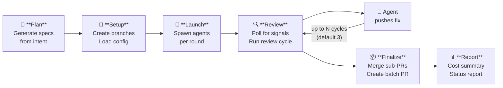
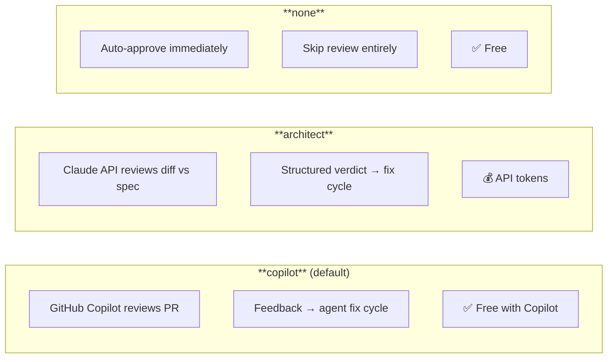

<p align="center">
  
  
  
</p>

<h1 align="center">🤖 AI Team CLI</h1>

<p align="center">
  <strong>Orchestrate parallel AI agents to ship features across your codebase.</strong><br/>
  Define specs, assign agents, and let the CLI handle branches, reviews, and PRs.
</p>

---

## What is AI Team?

AI Team is a CLI that turns a one-line feature description into working code across multiple agents. You describe what you want to build, and the CLI generates specs, creates branches, launches AI agents in parallel, runs automated code reviews, and opens a batch PR — all without manual intervention.

Each agent works in its own branch and can only modify files it owns (boundary-enforced). The orchestrator coordinates rounds, reviews, and merges so you can walk away while the work happens.

---

## Prerequisites

| Requirement | Version | Notes |
|-------------|---------|-------|
| [Node.js](https://nodejs.org/) | ≥ 22 | Required for ESM and built-in test features |
| [Claude Code CLI](https://docs.anthropic.com/en/docs/claude-code) | Latest | Powers the AI agents (`claude` must be on your PATH) |
| Git | Any recent | Must be authenticated with push access to your repo |
| GitHub repo | — | Agents open PRs via the GitHub API |
| [Anthropic API key](https://console.anthropic.com/) | — | All agents run via the Claude API |

---

## Quick Start

### 1. Install

```bash
npm i -D ai-team@github:EwneoN/ai-team
```

### 2. Configure

Copy [`config.json.example`](config.json.example) to `.ai-team/config.json` and define your agent roles, the models they use, and which files they're allowed to touch.

```bash
mkdir -p .ai-team
cp node_modules/ai-team/config.json.example .ai-team/config.json
# Edit .ai-team/config.json with your agents, paths, and models
```

### 3. Scaffold project files

```bash
npx ai-team -p .ai-team init
```

This creates `.github/agents/planner.agent.md` (VS Code agent mode) and `.claude/commands/plan.md` (Claude Code slash command) for interactive planning.

### 4. Plan your feature

The fastest way to get started. Describe what you want in plain English:

```bash
npx ai-team -p .ai-team plan "add billing with Stripe"
```

The planner explores your codebase, generates spec files in `docs/specs/`, and produces a batch file in `.ai-team/batches/`. See [Planning Workflow](#planning-workflow) for details.

### 5. Validate and run

```bash
# Pre-flight check — catches boundary violations, missing files, config issues
npx ai-team -p .ai-team validate -b .ai-team/batches/add-billing-with-stripe.json

# Full lifecycle — branches, agents, reviews, batch PR
npx ai-team -p .ai-team orchestrate -b .ai-team/batches/add-billing-with-stripe.json
```

That's it. The orchestrator creates branches, launches agents, runs review cycles, and opens a batch PR. Use `monitor` to watch progress:

```bash
npx ai-team -p .ai-team monitor add-billing-with-stripe
```

---

## How It Works



Each agent gets its own branch and workspace. The orchestrator polls for completion signals, triggers reviews via GitHub Copilot or Claude API, and feeds comments back to agents automatically.

---

## Planning Workflow

You don't have to write specs and batch files by hand. The **plan** system generates them from a one-line intent. There are three modes:

| Mode | Best for | How it works |
|------|----------|--------------|
| **Claude Code** (`/project:plan`) | Interactive iteration (recommended) | A slash command that interviews you, generates via the CLI, then lets you iterate on specs before handing off |
| **CLI** (`ai-team plan`) | Quick, autonomous generation | A planning agent explores the codebase, writes specs, and produces a batch file — no interaction needed |
| **VS Code Chat** (`@planner`) | Interactive iteration in VS Code | A VS Code agent mode with the same 5-phase workflow as Claude Code |

### Claude Code Mode (Recommended)

For the best interactive experience, use the Claude Code slash command. First, scaffold it into your project:

```bash
npx ai-team -p .ai-team init
```

This creates `.claude/commands/plan.md`. In Claude Code, run:

```
/project:plan add billing with Stripe
```

The planner walks you through five phases:

1. **Clarify Intent** — Asks 1-2 scoping questions (which agents, constraints)
2. **Generate** — Runs `ai-team plan` in the terminal for deep codebase exploration
3. **Review & Surface** — Reads the generated specs and batch, shows you a summary with round assignments and file scope
4. **Iterate** — You refine specs, adjust rounds, rename things — the planner edits files in-place
5. **Handoff** — Runs `ai-team validate` and gives you the final orchestrate command

This gives you the benefit of autonomous codebase exploration (via the CLI) combined with human-in-the-loop refinement (via chat).

### CLI Mode

For quick, non-interactive generation:

```bash
npx ai-team -p .ai-team plan "add billing with Stripe"
```

The planner agent:
1. Reads your `config.json` to understand available agents and boundaries
2. Explores the codebase for existing patterns and conventions
3. Generates spec files in `docs/specs/`
4. Produces a batch file in `.ai-team/batches/`
5. Validates the output and prints a summary

The generated specs and batch are ready to run immediately:

```bash
npx ai-team -p .ai-team validate -b .ai-team/batches/add-billing-with-stripe.json
npx ai-team -p .ai-team orchestrate -b .ai-team/batches/add-billing-with-stripe.json
```

### VS Code Chat Mode

The same interactive workflow is also available as a VS Code agent mode. The `init` command scaffolds `.github/agents/planner.agent.md` alongside the Claude Code slash command. In VS Code Copilot Chat, switch to the **Planner** agent mode and describe what you want to build — it follows the same five phases as the Claude Code mode.

---

## Writing Specs

> **Tip:** The [planner](#planning-workflow) generates specs automatically. This section is for when you want to write or edit specs manually.

Specs are Markdown files that tell an agent **what to build**. The agent reads the spec from disk at startup — the content is not embedded in the prompt, so specs can be any length without affecting token budgets.

### How agents receive specs

1. Batch file references `specPath: "docs/specs/my-feature.md"` (relative to project root)
2. The CLI generates a `CLAUDE.md` that tells the agent to read the spec from that path
3. The agent reads the file from its own workspace clone and implements it

### Structure

A spec should answer: **what** to build, **where** to put it, and **how to verify** it works. Use this structure as a starting point:

~~~markdown
# Spec: {Agent Role} — {Feature Name}

## Summary
One paragraph describing the deliverable. Be specific about what changes
and what stays the same.

## Target Agent
**Backend Engineer** (or whichever role)

## Scope
- Files to create or modify
- Files that are off-limits (if relevant)

## Requirements
### 1. First requirement
Detail with code examples, API signatures, or schema fragments.

### 2. Second requirement
...

## Acceptance Criteria
- [ ] Unit tests pass for X
- [ ] Mutation handles edge case Y
- [ ] No regressions in existing tests

## Out of Scope
- Things the agent should NOT do
- Work deferred to a future spec
~~~

### Tips

- **Be precise about file paths.** Agents work best when you name exact files: _"Modify `amplify/functions/resolvers/matchState.ts`"_ beats _"update the match state resolver"_.
- **Include code snippets** for schemas, type signatures, or expected API shapes. Agents follow concrete examples more reliably than prose descriptions.
- **State what NOT to do.** If the agent should avoid refactoring adjacent code or adding unrelated features, say so explicitly.
- **One spec per assignment.** Multiple agents can share the same spec file — use a `## Target Agent` section so each agent knows which parts apply to them.
- **Acceptance criteria are your test cases.** The agent will use these to verify its own work and they become the basis for review.
- **Reference existing code.** If the agent needs to follow patterns from existing files, name them: _"Follow the pattern in `createTeam.ts` for error handling"_.

### Multi-agent specs

A single spec file can target multiple agents. Each assignment's `description` in the batch file tells the agent its specific task, while the spec provides shared context:

```json
{
  "assignments": [
    {
      "agent": "backend",
      "spec": "user-management",
      "specPath": "docs/specs/user-management.md",
      "description": "Implement the /users CRUD resolvers (see spec §2)"
    },
    {
      "agent": "frontend",
      "spec": "user-management",
      "specPath": "docs/specs/user-management.md",
      "description": "Build the user list and edit form (see spec §4)"
    }
  ]
}
```

---

## Batch Files

Batch files live in `.ai-team/batches/` and define what work to run.

```json
{
  "name": "user-management",
  "baseBranch": "main",
  "description": "Add user CRUD endpoints and UI",
  "assignments": [
    {
      "agent": "backend",
      "spec": "user-endpoints",
      "specPath": "docs/specs/user-endpoints.md",
      "description": "Implement /users CRUD endpoints",
      "round": 1
    },
    {
      "agent": "frontend",
      "spec": "user-form",
      "specPath": "docs/specs/user-form.md",
      "description": "Build user creation form",
      "round": 1,
      "model": "claude-opus-4-6"
    },
    {
      "agent": "backend",
      "spec": "user-notifications",
      "specPath": "docs/specs/user-notifications.md",
      "description": "Add email notifications on user creation",
      "round": 2
    }
  ]
}
```

| Field | Type | Description |
|-------|------|-------------|
| `name` | string | Unique batch name (used for branch names and signal files) |
| `baseBranch` | string? | Create batch from this branch (default: `mainBranch` from config) |
| `description` | string | Human-readable description |
| `assignments[].agent` | string | Agent key (must match a key in `config.agents`) |
| `assignments[].spec` | string | Spec identifier (used in branch names) |
| `assignments[].specPath` | string | Path to the spec file the agent should follow |
| `assignments[].description` | string | What the agent should do |
| `assignments[].round` | number? | Execution round (default: 1). See [Rounds](#rounds) |
| `assignments[].model` | string? | Per-assignment model override (see [Model Resolution](#model-resolution)) |

---

## Rounds

Assignments have an optional `round` field (default: 1). All round-1 assignments launch in parallel. Round 2 waits for round 1 to complete and merge, then launches. This lets you sequence dependent work — for example, schema changes in round 1, then API handlers that depend on those changes in round 2.

```json
{
  "assignments": [
    { "agent": "backend", "spec": "schema-changes", "round": 1 },
    { "agent": "frontend", "spec": "ui-components", "round": 1 },
    { "agent": "backend", "spec": "api-handlers", "round": 2 }
  ]
}
```

> **Constraint:** Two assignments sharing the same agent (= same workspace) must be in different rounds.

> **Failure blocks progression:** If *any* agent in round N fails or hits max review cycles, round N+1 is blocked until the failure is resolved. Use the [`reset`](#reset) command to unblock.

---

## Commands

All commands accept `-p, --project-dir <path>` (or env `AI_TEAM_PROJECT_DIR`) to locate the `.ai-team/` directory.

### `orchestrate`

Full lifecycle: create branches → launch agents → poll → review → fix cycles → merge → batch PR.

```bash
npx ai-team -p .ai-team orchestrate -b .ai-team/batches/my-feature.json
npx ai-team -p .ai-team orchestrate -b .ai-team/batches/my-feature.json --review-mode architect
npx ai-team -p .ai-team orchestrate -b .ai-team/batches/my-feature.json --review-only  # skip branch creation + launch
npx ai-team -p .ai-team orchestrate -b .ai-team/batches/my-feature.json --visible      # open in Windows Terminal tabs
```

| Flag | Description |
|------|-------------|
| `-b, --batch-file <path>` | **(required)** Path to batch JSON file |
| `--skip-branches` | Skip branch creation (branches already exist) |
| `--skip-launch` | Skip agent launch (agents already running) |
| `--review-only` | Skip both branch creation and launch |
| `--poll-interval <seconds>` | Override signal poll interval |
| `--review-mode <mode>` | `copilot` (default), `architect`, or `none` |
| `--pr-title <title>` | Override batch PR title (default: `feat: {batchName}`) |
| `--timeout <minutes>` | Idle timeout; 0 = disable (default: config or 90) |
| `--visible` | Open agents in visible Windows Terminal tabs |
| `--detach` | Launch orchestrator in a new terminal window |

### `plan`

Generate specs and a batch file from a high-level intent using a planning agent. The planner explores the codebase, reads existing patterns, and produces ready-to-run specs.

```bash
npx ai-team -p .ai-team plan "add billing with Stripe"
npx ai-team -p .ai-team plan "add billing with Stripe" -n billing-v1
npx ai-team -p .ai-team plan "add billing with Stripe" --model claude-opus-4-6
```

| Flag | Description |
|------|-------------|
| `<intent>` | **(required, positional)** High-level description of what to build |
| `-o, --output-dir <dir>` | Directory for generated specs (default: `docs/specs`) |
| `-n, --batch-name <name>` | Batch name (defaults to slugified intent) |
| `--model <model>` | Model override for the planner agent |

### `init`

Scaffold project customization files from built-in templates.

```bash
npx ai-team -p .ai-team init
npx ai-team -p .ai-team init --force   # overwrite existing files
```

| Flag | Description |
|------|-------------|
| `--force` | Overwrite existing files |

### `validate`

Pre-flight validation before running a batch. Checks batch schema, agent boundaries, workspace collisions, and config sync.

```bash
npx ai-team -p .ai-team validate -b .ai-team/batches/my-feature.json
npx ai-team -p .ai-team validate -b .ai-team/batches/my-feature.json --warn-only
```

| Flag | Description |
|------|-------------|
| `-b, --batch-file <path>` | **(required)** Path to batch JSON file |
| `--warn-only` | Print warnings but don't fail on boundary violations |

### `validate-config`

Check that `config.json` is valid and print a summary.

```bash
npx ai-team -p .ai-team validate-config
```

### `create-batch`

Create the batch branch and a sub-branch per assignment. Cleans old signal files.

```bash
npx ai-team -p .ai-team create-batch -b .ai-team/batches/my-feature.json
```

| Flag | Description |
|------|-------------|
| `-b, --batch-file <path>` | **(required)** Path to batch JSON file |

### `launch`

Spawn agents for a batch. Each agent gets a `CLAUDE.md` generated from the template, checks out its sub-branch, and runs via the Claude Agent SDK.

```bash
# Launch all agents in the batch
npx ai-team -p .ai-team launch -b .ai-team/batches/my-feature.json

# Launch only the backend agent
npx ai-team -p .ai-team launch -b .ai-team/batches/my-feature.json -a backend

# Preview without starting processes
npx ai-team -p .ai-team launch -b .ai-team/batches/my-feature.json --dry-run

# Run in foreground (blocking)
npx ai-team -p .ai-team launch -b .ai-team/batches/my-feature.json --inline
```

| Flag | Description |
|------|-------------|
| `-b, --batch-file <path>` | **(required)** Path to batch JSON file |
| `-a, --agent <key>` | Launch only this agent (e.g. `backend`) |
| `--dry-run` | Generate files but don't start processes |
| `--inline` | Run agents in foreground instead of background |
| `--visible` | Open each agent in a visible Windows Terminal tab |
| `--detach` | Launch in a new terminal window |

### `run`

Run a single agent interactively in the foreground. Useful for debugging or running one assignment manually.

```bash
npx ai-team -p .ai-team run -b .ai-team/batches/my-feature.json -a backend -s add-user-endpoint
```

| Flag | Description |
|------|-------------|
| `-b, --batch-file <path>` | **(required)** Path to batch JSON file |
| `-a, --agent <key>` | **(required)** Agent key (e.g. `backend`) |
| `-s, --spec <name>` | **(required)** Spec name |

### `monitor`

Live dashboard showing agent status. Auto-refreshes until all agents complete or you press Ctrl+C.

```bash
npx ai-team -p .ai-team monitor my-feature
npx ai-team -p .ai-team monitor my-feature -i 5   # poll every 5 seconds
```

| Flag | Description |
|------|-------------|
| `<batchName>` | **(required, positional)** Batch name to monitor |
| `-i, --interval <seconds>` | Poll interval (default: from config) |

### `status`

Pretty-print the current state of a batch: phase, per-agent status, PR numbers, review cycles, live process detection, and cost.

```bash
npx ai-team -p .ai-team status my-feature
npx ai-team -p .ai-team status my-feature --json
```

| Flag | Description |
|------|-------------|
| `<batchName>` | **(required, positional)** Batch name to inspect |
| `--json` | Output machine-readable JSON |

Sample output:

```
  Batch: match-flow-v2-backend
  Phase: polling (Phase 2)
  Started: 2026-03-30T10:00:00Z
  Total Cost: $2.4312

  Agents:
  Agent/Spec                                         Status               PR       Cycles   Live
  ────────────────────────────────────────────────     ────────────────     ────     ────     ─────
  backend/backend-drive-state                         ✅ approved          #42      2        ✗
  backend/backend-postgame-winnings                   🔧 changes-requested #43      1        ✓
  designer/designer-match-flow-v2                     ❌ failed            #44      3        ✗

  Summary: ✅ approved: 1  |  🔧 changes-requested: 1  |  ❌ failed: 1
```

### `list-batches`

Discover all known batches from signal files and batch definitions. Shows phase, agent counts, cost, and start date.

```bash
npx ai-team -p .ai-team list-batches
npx ai-team -p .ai-team list-batches --json
```

| Flag | Description |
|------|-------------|
| `--json` | Output machine-readable JSON |

### `cost-report`

Show token usage and cost breakdown from the cost ledger.

```bash
npx ai-team -p .ai-team cost-report
npx ai-team -p .ai-team cost-report -b my-feature
npx ai-team -p .ai-team cost-report --json
```

| Flag | Description |
|------|-------------|
| `-b, --batch <name>` | Filter by batch name |
| `--json` | Output raw JSON instead of formatted table |

### `clean`

Archive log files and delete PID state for completed batches. Signal files and orchestrator state are preserved for diagnostics.

```bash
npx ai-team -p .ai-team clean -b my-feature         # clean one batch
npx ai-team -p .ai-team clean --all                  # clean all completed batches
npx ai-team -p .ai-team clean --all --dry-run        # preview without changes
npx ai-team -p .ai-team clean --all --force          # clean regardless of phase
```

| Flag | Description |
|------|-------------|
| `-b, --batch <name>` | Clean a specific batch |
| `--all` | Clean all completed/merged batches |
| `--dry-run` | Preview what would be cleaned |
| `--force` | Clean batches regardless of phase (including active ones) |

> **Auto-cleanup:** The orchestrator also runs cleanup automatically after merging sub-PRs and creating the batch PR (Phase 5).

### `archive-logs`

Move completed batch logs into `logs/archived/{batchName}/`.

```bash
npx ai-team -p .ai-team archive-logs -b my-feature
npx ai-team -p .ai-team archive-logs --all
npx ai-team -p .ai-team archive-logs --all --dry-run   # preview without moving
```

| Flag | Description |
|------|-------------|
| `-b, --batch <name>` | Archive logs for a specific batch |
| `--all` | Archive all detected batches |
| `--dry-run` | Preview what would be archived |

### `reset`

Reset an agent to a specific state for recovery. See [Troubleshooting](#troubleshooting) for detailed usage.

```bash
npx ai-team -p .ai-team reset -b my-feature -a backend -s user-endpoints --to retry
npx ai-team -p .ai-team reset -b my-feature -a backend -s user-endpoints --to approved
npx ai-team -p .ai-team reset -b my-feature -a backend -s user-endpoints --to fresh
npx ai-team -p .ai-team reset -b my-feature -a backend -s user-endpoints --to retry --dry-run
```

| Flag | Description |
|------|-------------|
| `-b, --batch <name>` | **(required)** Batch name |
| `-a, --agent <key>` | **(required)** Agent key (e.g. `backend`) |
| `-s, --spec <name>` | **(required)** Spec name |
| `--to <preset>` | **(required)** Reset preset: `retry`, `fresh`, or `approved` |
| `--dry-run` | Preview changes without applying them |
| `--force` | Reset even if agent has a live process |

---

## Config

See [`config.json.example`](config.json.example) for a working starting point.

### `project`

| Field | Type | Description |
|-------|------|-------------|
| `name` | string | Project name (used for branch naming and workspace derivation) |
| `repoUrl` | string | Git remote URL |
| `mainBranch` | string | Default branch (usually `main`) |
| `emailDomain` | string? | Domain for agent git emails (default: `{name}.local`) |

### `agents`

Keyed by agent identifier (e.g. `backend`, `frontend`, `designer`).

| Field | Type | Description |
|-------|------|-------------|
| `displayName` | string | Human-readable label (e.g. `"Backend Engineer"`) |
| `agentId` | string | Agent SDK identifier |
| `workingDir` | string? | Absolute path to agent workspace clone. Auto-derived from `workingDirBase` if omitted |
| `briefPath` | string | Path to the agent's brief/prompt file |
| `globalRulesPath` | string | Path to global rules (e.g. `.github/copilot-instructions.md`) |
| `chatmodeFile` | string | Path to agent mode file (e.g. `.github/agents/backend.md`) |
| `ownedPaths` | string[] | Glob patterns this agent is allowed to modify (boundary checking) |
| `branchPrefix` | string | Prefix for branch names (e.g. `backend` → `batch/name--backend--spec`) |
| `maxReviewCycles` | number? | Per-agent override (falls back to `settings.maxReviewCycles`) |
| `model` | string? | Per-agent model override (see [Model Resolution](#model-resolution)) |

### `models`

| Field | Type | Description |
|-------|------|-------------|
| `architect` | string | Model for architect reviews and the `architect` agent |
| `coAgent` | string | Default model for all other agents |
| `fallback` | string | Fallback model |

### `settings`

| Field | Type | Default | Description |
|-------|------|---------|-------------|
| `reviewMode` | string | `"copilot"` | `copilot`, `architect`, or `none` |
| `copilotReviewPollIntervalSeconds` | number | `30` | How often to poll for Copilot review completion |
| `copilotReviewTimeoutMinutes` | number | `10` | Max wait for Copilot review |
| `maxReviewCycles` | number | `3` | Max review-fix cycles per agent |
| `monitorPollIntervalSeconds` | number | `15` | Signal poll interval |
| `maxRetries` | number | `2` | API retry attempts |
| `retryBaseDelaySeconds` | number | `5` | Backoff base delay |
| `launchStaggerSeconds` | number | `2` | Delay between agent spawns |
| `maxBudgetUsd` | number | | Per-agent spend cap |
| `maxBatchBudgetUsd` | number? | `50` | Per-batch budget cap — orchestrator stops dispatching when exceeded |
| `reviewMaxBudgetUsd` | number? | `2` | Budget cap for review-fix runs |
| `reviewMaxTurns` | number? | `30` | Max turns for review-fix runs |
| `softApproveAfterCycle` | number? | `3` | Cycle threshold for soft-approving minor comments (0 = disabled) |
| `softApproveMaxComments` | number? | `3` | Max new comments allowed for soft-approve |
| `filterOldCodeAfterCycle` | number? | `3` | Cycle threshold for auto-skipping NIT comments on unchanged files (0 = disabled). Uses a cheap Haiku call to classify severity; CRITICAL/IMPORTANT comments still forwarded. |
| `workingDirBase` | string? | `"../"` | Base directory for agent workspace clones (relative to project root) |
| `maxOrchestratorMinutes` | number? | `90` | Idle timeout — orchestrator exits after this long with no activity (0 = disable) |
| `architectReviewHints` | string? | | Project-specific hints injected into architect review prompts |
| `notifications.enabled` | boolean | | Enable/disable desktop notifications |

---

## Review Modes

Set via `--review-mode` flag on `orchestrate`, or `settings.reviewMode` in config.



---

## Model Resolution

Models are resolved with this priority chain (highest wins):

1. **Batch assignment** — `assignments[].model` in the batch file
2. **Agent config** — `agents.{key}.model` in config.json
3. **Global default** — `models.architect` for the `architect` agent, `models.coAgent` for all others

```
# Example: designer uses opus, everything else uses sonnet

# config.json
"agents": {
  "designer": { "model": "claude-opus-4-6", ... },
  "backend":  { ... }
},
"models": { "coAgent": "claude-sonnet-4-6", ... }

# batch file — override one specific assignment
{ "agent": "backend", "spec": "critical-fix", "model": "claude-opus-4-6", ... }
```

---

## Boundary Checking

Each agent has `ownedPaths` — glob patterns defining which files it's allowed to modify. Boundaries are enforced at two levels:

1. **Post-commit hook** — A git hook installed in each agent's workspace runs `boundary-hook.js` after every commit. If the committed files include anything outside `ownedPaths`, the hook soft-resets the commit (files remain staged) and prints a clear error. Uses post-commit (not pre-commit) because Claude Code passes `--no-verify` which skips pre-commit hooks. Exit code 10 = violations found.

2. **Orchestrator validation** — After an agent pushes code, the orchestrator validates that all changed files match at least one owned path as a second layer of defense.

Both layers use `minimatch` with the same glob matching logic (`checkBoundaryViolations()` in `boundary-check.ts`).

---

## Comment Status Tracking

During review cycles, the orchestrator posts **threaded reply comments** on each PR review comment with emoji status indicators showing how the comment was processed:

| Emoji | Meaning | Who sets it |
|-------|---------|-------------|
| 👀 | Comment seen | Orchestrator (when review comments are read) |
| 🧠 | Comment reviewed and dispatched to agent | Orchestrator (before dispatching fix cycle) |
| 🛠️ | Agent will fix this | Orchestrator (auto-inserted before ✅) |
| ❌ | Agent won't fix (with reason) | Co-agent (via `comment-outcomes.json`) |
| ✅ | Fix applied | Co-agent (via `comment-outcomes.json`) |
| ☑️ | Intentionally skipped (with reason) | Co-agent (via `comment-outcomes.json`) |

Each original review comment gets a **single threaded reply** that is **edited in-place** as status progresses:

```
👀 ➜ 🧠 ➜ 🛠️ ➜ ✅

*backend · cycle 3*
```

For won't-fix or skipped comments, the reply includes a reason:

```
👀 ➜ 🧠 ➜ ❌ Won't fix

**Reason:** Already handled by existing validation in `validateLeagueName()`.

*backend · cycle 2*
```

Agents report per-comment outcomes by writing a `comment-outcomes.json` file in the signals directory after addressing review feedback. Valid statuses are `fixed`, `skipped` (with reason), and `wont-fix` (with reason). The 🛠️ (`will-fix`) status is auto-inserted by the orchestrator when building the `fixed` chain — agents don't need to emit it. If the agent doesn't write this file (backward compatible), dispatched comments remain in the 🧠 reviewed state until an outcome is recorded.

---

## Notifications

Desktop notifications fire so you can walk away while agents work:

| Event | Example |
|-------|---------|
| ✅ PR approved | _"PR #13 approved. Ready for review & merge."_ |
| ❌ Agent failed | Failure details |
| ⚠️ Max cycles hit | _"PR #13 hit 3 review cycles. Needs help."_ |
| 🎉 Batch done | _"All 3 PRs approved! Ready for merge."_ |

Disable with `"notifications": { "enabled": false }` in config.

---

## Troubleshooting

The `reset` command is the primary tool for recovering from stuck or failed agents without restarting the entire batch. The orchestrator blocks round progression when any agent fails, so `reset` is how you unblock things.

### Reset presets

| Preset | Status After | Use When | Preserves |
|--------|-------------|----------|----------|
| `retry` | `completed` | Agent failed during review cycles but its code/PR is salvageable. You want it to re-enter the review flow. | PR, review history, branch |
| `approved` | `approved` | Agent's work is good enough — you want to skip further reviews and unblock the next round. | PR, review history, branch |
| `fresh` | `pending` | Agent's work is unsalvageable. Wipe everything and start over from scratch. | Nothing — clears all state |

### Agent hit max review cycles

The agent pushed fixes 3 times but the reviewer keeps finding issues. You've looked at the PR and it's acceptable:

```bash
# Option A: Force-approve and move on
npx ai-team -p .ai-team reset -b my-feature -a backend -s user-endpoints --to approved

# Option B: Give it another chance in the review flow
npx ai-team -p .ai-team reset -b my-feature -a backend -s user-endpoints --to retry
```

### Agent failed (crashed, budget exceeded, or produced bad output)

Check `status` first to understand what happened:

```bash
# See what state everything is in
npx ai-team -p .ai-team status my-feature

# The failed agent is blocking round 2. Its PR looks fine — force-approve it:
npx ai-team -p .ai-team reset -b my-feature -a designer -s ui-components --to approved

# Or if the PR is garbage, wipe it and relaunch:
npx ai-team -p .ai-team reset -b my-feature -a designer -s ui-components --to fresh
npx ai-team -p .ai-team launch -b .ai-team/batches/my-feature.json -a designer
```

### Round N+1 is blocked

The orchestrator logs: `Round 1 has failed agent(s) — blocking round 2: designer/ui-components`

```bash
# Check which agents are blocking
npx ai-team -p .ai-team status my-feature

# Approve the blocker to unblock (if its PR is acceptable)
npx ai-team -p .ai-team reset -b my-feature -a designer -s ui-components --to approved

# The orchestrator picks this up on the next poll cycle and launches round 2
```

### Preview before committing

Not sure what a preset will do? Preview first:

```bash
npx ai-team -p .ai-team reset -b my-feature -a backend -s user-endpoints --to retry --dry-run
```

### Agent has a live process

If the agent is still running, `reset` refuses to touch it (safety check). Override with `--force` if you're sure:

```bash
npx ai-team -p .ai-team reset -b my-feature -a backend -s user-endpoints --to retry --force
```

### What each preset changes

**`retry`** — lightest touch, keeps the PR and review history:
- Status → `completed` (re-enters review flow on next poll)
- Clears: `processedSignalIds`, `copilotReviewRequestedAt`, `reviewAgentPid`, `deathRetries`, `boundaryRetries`
- Deletes the agent's signal file (prevents dedup skip)

**`approved`** — skips reviews entirely:
- Status → `approved`
- Adds a synthetic "Force-approved via reset command" review history entry
- Clears: `processedSignalIds`, `reviewAgentPid`
- Deletes the agent's signal file

**`fresh`** — nuclear option, starts from scratch:
- Status → `pending` (needs manual relaunch)
- Clears: everything — `prNumber`, `prUrl`, `reviewHistory`, `processedSignalIds`, `lastReviewedCycle`, all retry counters, all cost tracking
- Deletes the agent's signal file
- **You must manually relaunch** the agent after a fresh reset

After a `fresh` reset, the agent is in `pending` state. Relaunch it:

```bash
npx ai-team -p .ai-team reset -b my-feature -a backend -s user-endpoints --to fresh
npx ai-team -p .ai-team launch -b .ai-team/batches/my-feature.json -a backend
```

The orchestrator will detect the newly launched agent and resume tracking it.

---

## Project Layout

```
your-project/
├── .ai-team/
│   ├── config.json          # Agent definitions, models, settings
│   ├── batches/             # Batch files (one per feature)
│   ├── signals/             # Runtime state, orchestrator state (auto-managed)
│   ├── logs/                # Agent logs, prompts, CLAUDE.md copies
│   └── cost-ledger.jsonl    # Append-only cost tracking
├── .claude/
│   └── commands/
│       └── plan.md              # Claude Code slash command for interactive planning
├── .github/
│   └── agents/
│       └── planner.agent.md     # VS Code agent mode for interactive planning
└── docs/specs/                  # Spec files referenced by batch assignments
```

---

## Contributing

See [CONTRIBUTING.md](CONTRIBUTING.md) for development setup, project structure, test suites, and dependencies.


